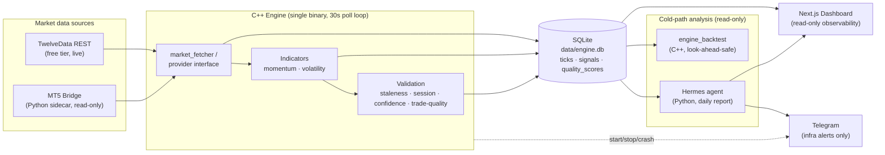

# Market Microstructure Engine

[](https://github.com/Kadir70-dev/market-microstructure-engine/actions/workflows/ci.yml)


A C++ market-intelligence engine that polls live FX / metals / energy quotes,
runs them through a momentum + volatility + validation pipeline, and persists
every observation to SQLite as **immutable ground truth** — so signals and
trade-quality scores can be re-derived and back-tested honestly, without
look-ahead bias.

> **Status: data-collection & research phase. This system does not place
> trades.** No broker order ever leaves this codebase. The MT5 integration is
> read-only and guarded by a `demo_only` tripwire. See
> [Risk philosophy](#risk-philosophy).

---

## Why I built this

Most "trading bot" portfolios are a backtest in a notebook that quietly
overfits and would never survive contact with a live feed. I wanted to build
the *opposite*: the unglamorous infrastructure that has to exist **before**
you are allowed to risk a single dollar —

- a feed you can trust,
- a database you can't accidentally rewrite,
- a backtest that refuses to fabricate returns across downtime gaps,
- an ops layer that restarts itself and tells you when it's lying,
- and a hard, auditable wall between "analysis" and "execution."

The trading edge is *deliberately* the last thing built, not the first. This
repo is the honest foundation.

---

## Problem statement

Retail algo-trading fails for boring reasons long before strategy quality
matters:

1. **Bad data** — stale quotes, cached API responses, weekend freezes, and
   symbol-resolution bugs silently poison every downstream decision.
2. **Look-ahead bias** — backtests that peek at future prices or paper over
   engine downtime produce returns that evaporate live.
3. **Survivability** — an engine that dies at 02:00 UTC and nobody notices has
   a 0% Sharpe regardless of strategy.
4. **No firewall** — "just let it trade" is how accounts get blown up.

This engine attacks (1)–(4) **first**, and treats alpha as a later, separate
problem to be measured — not assumed.

---

## Architecture



**Hot path** (live, every 30s): feed → indicators → validation → SQLite.
**Cold path** (read-only, on demand / EOD): SQLite → backtest + Hermes → alerts.

The two paths share nothing but the database file, and the cold path opens it
**read-only**. A bug in analysis can never corrupt collected data.

---

## Trading pipeline

For each symbol, every cycle:

| Stage | Module | Output |
|---|---|---|
| Fetch | `market_data/` | mid price (TwelveData REST or MT5 bid/ask mid) |
| Momentum | `indicators/momentum.cpp` | `Bullish` / `Bearish` / `Neutral` (±1e-7 dead-zone) |
| Volatility | `indicators/volatility.cpp` | stddev of log-returns → `LOW` / `MEDIUM` / `HIGH` (scale-invariant) |
| Staleness | `validation/validation.cpp` | byte-frozen feed detection (catches weekend/cache/symbol bugs) |
| Session | `validation/validation.cpp` | UTC session: `Asia` / `London` / `LondonNY` / `NewYork` / `Closed` |
| Confidence (0–100) | `validation/validation.cpp` | scaled by warm-up, vol regime, momentum |
| Trade quality (0–100) + grade | `validation/validation.cpp` | confidence × session multiplier → `A/B/C/D` |
| Persist | `storage/sqlite_logger.cpp` | atomic per-symbol write of all three rows |

All three rows for a cycle share one timestamp and commit in a single
transaction — so the backtest JOIN can never silently drop a half-written
cycle.

---

## Hermes agent

`agent/hermes/` is a **read-only analyst**, not a trader. Once a day (or on
demand) it reads `engine.db`, computes:

- signal counts and bull/bear/neutral mix,
- per-symbol confidence and trade-quality stats,
- forward 60s directional accuracy by confidence band — using the **same
  look-ahead/staleness exclusion rules as the C++ backtest**,
- session & volatility-regime distributions,
- an automatic **Problems Found** section (frozen feed, neutral over-trigger,
  schedule misalignment, sub-coin-flip high-confidence accuracy),
- concrete **Recommendations** tied to specific source files.

Output: `agent/hermes/reports/YYYY-MM-DD.md`. Hermes "does not place trades,
does not connect to brokers, and does not bypass risk management" — and the
code enforces that by simply not having those capabilities.

See sample output in [`agent/hermes/reports/`](agent/hermes/reports/).

---

## MT5 bridge

`agent/mt5_bridge/` is a small NDJSON-over-TCP Python sidecar that runs on the
Windows host where MetaTrader 5 lives, letting the Linux C++ engine pull broker
quotes. **Phase 1 is read-only:** it serves exactly two operations, `ping` and
`quote`. There are *no order operations in the code at all*.

Defense in depth against accidental live trading:

- The bridge refuses to start against a non-DEMO account unless **both**
  `ENABLE_LIVE_TRADING=true` **and** a `confirm_live_trading.txt` file exist.
- The bridge's `ping` reports `demo_only`. The C++ engine **refuses to start**
  if it connects to a bridge reporting `demo_only=false`.
- `MT5_BRIDGE_MOCK=true` serves a synthetic random walk so the whole path is
  testable on Linux with no MetaTrader install.

Protocol spec: [`agent/mt5_bridge/protocol.md`](agent/mt5_bridge/protocol.md).
Setup: [`docs/MT5_BRIDGE.md`](docs/MT5_BRIDGE.md).

---

## Risk philosophy

> **The system is not allowed to make money yet, because it has not yet earned
> the right to lose it.**

1. **No execution path exists.** Not disabled — *absent*. There is no order
   function to accidentally call.
2. **Demo-only tripwires** gate the MT5 bridge at two independent layers.
3. **Telegram is for infra only** — start/stop/crash/feed alerts. It is wired
   to *never* carry a trading action, by design and by comment contract.
4. **Costs are modeled before profits are believed.** The backtest applies
   round-trip spread/commission per symbol and reports **net** alongside gross.
5. **Honest exclusion over fabricated returns.** Observations spanning engine
   downtime are dropped, not interpolated.

The path to real money is staged and gated, and each gate is a deliberate,
auditable decision — see [Roadmap](#roadmap).

---

## Backtesting

`engine_backtest` is a **separate read-only binary** that links only sqlite3 —
none of the live engine code. It joins `signals ⋈ quality_scores ⋈ ticks` and
reports bull/bear directional accuracy + mean return at **+60s / +300s / +900s**
horizons, grouped by symbol, volatility regime, and confidence band.

Look-ahead and survivorship gates it enforces:

- **Baseline** = last tick *at or before* the signal, within 120s — never a
  price from a dead-engine gap.
- **Future** = first tick *at or after* `signal.ts + horizon`, within a
  one-cycle tolerance; outside that window the observation is **excluded**, not
  fabricated.
- **Stale** signals are dropped entirely.
- **Neutral** momentum counts toward N but is a non-trade, never a wrong-way
  trade.
- A **cost model** applies per-symbol round-trip costs and reports net returns.

Sample snapshots: [`reports/snapshots/`](reports/snapshots/).

### Tests & CI

The pure logic is covered by tests that run on every push/PR via
[GitHub Actions](.github/workflows/ci.yml):

- **C++ unit tests** (`tests/unit_tests.cpp`, 66 assertions, zero external test
  framework) — `validation.cpp` (staleness, UTC session boundaries, confidence,
  trade-quality, grading) and `evaluation/metrics.cpp` (gross/net accuracy, cost
  model, neutral-is-non-trade, no divide-by-zero), registered with CTest.
- **Hermes Python tests** (`agent/hermes/tests/`, stdlib `unittest`) — signal
  summarisation, confidence-accuracy exclusion rules, problem detection, the
  read-only DB boundary, and an end-to-end report-file generation against a
  temporary SQLite DB.

```bash
ctest --test-dir build --output-on-failure        # both suites
./build/unit_tests                                 # C++ only
python3 -m unittest agent.hermes.tests.test_daily_report -v   # Hermes only
```

> On the current small sample, momentum is ~100% `Neutral` and net edge is
> ~zero. That is the *correct* honest output for this much data — the engine is
> reporting "no signal," not inventing one. Establishing real edge requires
> weeks of session-aligned collection (that's the point of the data-collection
> phase).

---

## Dashboard

A read-only **Next.js** (TypeScript · Tailwind · Recharts) observability
dashboard lives in [`dashboard/`](dashboard/). It opens `engine.db`
**read-only** — mirroring the engine's cold-path boundary — and renders:

- KPIs (symbols, ticks, signals, mean confidence, stale %),
- normalized multi-symbol **price chart**,
- a **hypothetical equity curve** (gross vs **net of round-trip cost**, using the
  same look-ahead-safe gates as the C++ backtest — explicitly *not* traded),
- **signal analytics** (momentum mix, trade-quality grades, confidence histogram),
- **confidence calibration** (does higher confidence → higher realized accuracy?),
- **feed health** with frozen-feed detection,
- a **Hermes reports** viewer.

```bash
cd dashboard
npm install
npm run dev                                    # http://localhost:3000 (DEMO data)
DASHBOARD_DB_PATH=../data/engine.db npm run dev  # live data from your engine.db
```

Out of the box it shows a **deterministic demo session** (synthetic data derived
with the engine's exact formulas, clearly watermarked) so it renders richly and
deploys anywhere. See [`dashboard/README.md`](dashboard/README.md).

> The demo makes a deliberate point a recruiter should not miss: the signal has
> a positive **gross** edge that goes **negative after costs** at 30s cadence —
> which is *why* the engine collects data instead of trading.

## Screenshots

_Run the dashboard (above) and capture these four; drop the PNGs in `docs/img/`
and they render here._

| Image | What to capture |
|---|---|
| `docs/img/dashboard-overview.png` | Dashboard top: KPI row + price chart + equity curve |
| `docs/img/dashboard-analytics.png` | Signal analytics + confidence calibration |
| `docs/img/hermes-report.png` | The Hermes reports viewer (`/reports`) |
| `docs/img/backtest.png` | `engine_backtest` net-return table (terminal) |

<!--  -->
<!--  -->

---

## Setup

System deps (Ubuntu):

```bash
sudo apt install build-essential cmake libspdlog-dev libcurl4-openssl-dev \
                 libsqlite3-dev nlohmann-json3-dev sqlite3 python3
```

Build:

```bash
cmake -S . -B build
cmake --build build
```

Configure the data feed (one of):

```bash
# Option A — TwelveData (default). Put your free-tier key here:
echo "YOUR_TWELVEDATA_KEY" > config/api_key.txt && chmod 600 config/api_key.txt

# Option B — ops/.env (preferred for deployment; start_engine.sh materializes the key)
cp ops/.env.example ops/.env   # then fill in TWELVEDATA_API_KEY (+ optional Telegram)
```

Run (binaries open paths relative to `build/`, so run from there):

```bash
cd build && ./engine            # live 30s poll loop (Ctrl-C / SIGTERM stops cleanly)
cd build && ./engine_backtest   # read-only evaluation against accumulated data
```

Generate a daily report:

```bash
python3 -m agent.hermes.daily_report --date 2026-05-24
```

Production-style operation (managed lifecycle, health, recovery, schedule):

```bash
./ops/start_engine.sh      # background, idempotent, verifies it stayed up
./ops/status_engine.sh     # RUNNING/NOT + pid/uptime/last log line
python3 ops/health_check.py   # 6-point read-only health board
./ops/stop_engine.sh       # graceful SIGTERM → SIGKILL escalation
crontab ops/crontab.example   # auto start/stop on session schedule + 10-min health probe
```

Optional systemd auto-restart unit: [`ops/systemd/`](ops/systemd/).

---

## Roadmap

| Phase | Goal | Money at risk |
|---|---|---|
| **0 — Foundation** ✅ | Feed, validation, SQLite ground truth, look-ahead-safe backtest, ops layer, docs | None |
| **1 — Read-only MT5** ✅ (code) | Broker quotes via demo-only bridge; side-by-side feed comparison | None |
| **2 — Observability dashboard** ✅ | Read-only Next.js dashboard: price, equity, calibration, health, Hermes reports | None |
| **3 — Edge research** ⏳ | Weeks of session-aligned data; honest predictive baseline (logistic/GBM, walk-forward); replace hardcoded vol thresholds with empirical percentiles; demonstrate a *net-of-cost* edge | None |
| **4 — Paper / demo execution** | Order ops behind the double gate, demo account only; reconcile fills vs. signals | Demo only |
| **5 — Sized live** | Only if Phase 3 edge survives demo execution; small fixed size, kill-switch first | Real, minimal |

The order is intentional: **prove survivability and honesty before alpha,
prove alpha before risk.**

---

## Limitations (honest)

- **No demonstrated edge yet.** Current data is too small and shows ~zero net
  return — expected at this stage, but it means this is research infra, not a
  proven strategy.
- **Tests cover the pure logic, not the I/O edges.** Validation, metrics, and
  Hermes report generation are unit-tested and run in CI; the live HTTP fetch,
  the SQLite writer, and the MT5 socket path are not yet covered by automated
  tests (they're exercised manually / by mock mode).
- **Free-tier rate limits.** TwelveData free tier is 8 req/min; the engine runs
  ~6 req/min (3 symbols × 30s). No headroom for a 4th symbol without slowing the
  cycle.
- **30s polling, not tick-level.** This is a microstructure *engine* in
  architecture; the current feed resolution is coarse. True microstructure work
  needs the MT5 tick path matured.
- **WTI is an ETF proxy (USO).** The true `WTI/USD` CFD is paid-tier; `USO`
  tracks it imperfectly.
- **Volatility thresholds are hardcoded**, not empirically calibrated yet.
- **No predictive model yet** — "confidence" is a transparent heuristic, not a
  learned model. An honest, walk-forward-validated baseline is the next step
  (Phase 3), surfaced in the dashboard's calibration view.
- **Single host, single process.** No HA; recovery is restart-based.

---

## Why this system is technically interesting

- **Immutable-ground-truth data model.** Raw ticks are never overwritten;
  signals and quality scores are *derived* and re-derivable. Change a formula,
  re-run history — no re-collection needed.
- **Look-ahead bias is structurally prevented**, not just "avoided." Baseline
  and future prices come from explicit at-or-before / at-or-after tick lookups
  with downtime-gap tolerances; the backtest *excludes* rather than fabricates.
- **Two binaries, one DB, zero shared mutable state.** The evaluation harness
  links only sqlite3 and opens the DB read-only — analysis cannot corrupt data.
- **Atomic, JOIN-safe writes.** All three per-cycle rows share a timestamp and
  commit in one transaction, closing the orphan-row and silent-JOIN-loss races.
- **Safety as an architectural property.** "No live trading" is enforced by the
  *absence* of an execution path plus independent demo-only tripwires — not by a
  config flag someone can flip.
- **Production ops on a hobby budget.** Idempotent start/stop with
  PID-recycling-aware liveness checks, graceful SIGTERM→SIGKILL escalation,
  rotating logs, a 6-point health board, cron + optional systemd auto-recovery,
  and infra-only Telegram alerting.
- **Provider abstraction.** A single `IMarketDataProvider` interface lets the
  same pipeline run against TwelveData REST or the MT5 bridge, selected by env
  var, writing to separate DBs for honest side-by-side comparison.
- **An analyst that grades itself.** Hermes auto-flags its own data-quality
  problems and ties each recommendation to a specific source file.

---

## Repository layout

```
include/, src/        C++ engine — market_data / indicators / validation / storage / evaluation
tests/                C++ unit tests (CTest, zero external framework)
.github/workflows/    CI: build + test on every push/PR
dashboard/            Next.js read-only observability dashboard (TS/Tailwind/Recharts)
agent/hermes/         Python read-only daily analyst (Hermes) — tests in agent/hermes/tests/
agent/mt5_bridge/     Python MT5 sidecar (read-only, demo-gated)
ops/                  Production scripts: start/stop/status/health/recovery/cron/systemd
docs/                 Operations architecture, runbook, recovery, Monday checklist, MT5 setup
reports/snapshots/    Sample backtest + health snapshots (showcase)
data/                 SQLite ground truth (gitignored)
config/, logs/, run/  Secrets / logs / PID files (gitignored)
```

See [`CLAUDE.md`](CLAUDE.md) for the deep engineering reference.

---

## License

See [LICENSE](LICENSE) if present; otherwise all rights reserved by the author.

_Built as a serious systems-and-quant engineering exercise: honest data,
honest backtests, honest limits._
