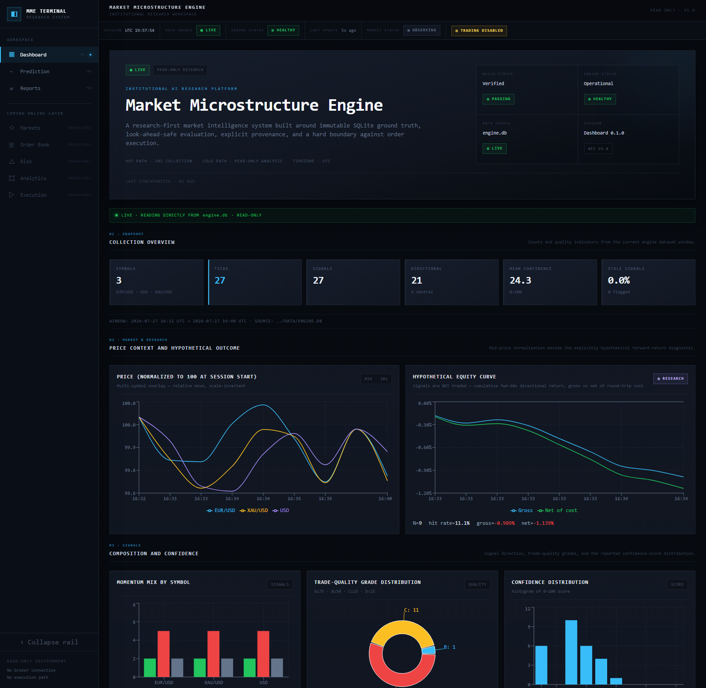
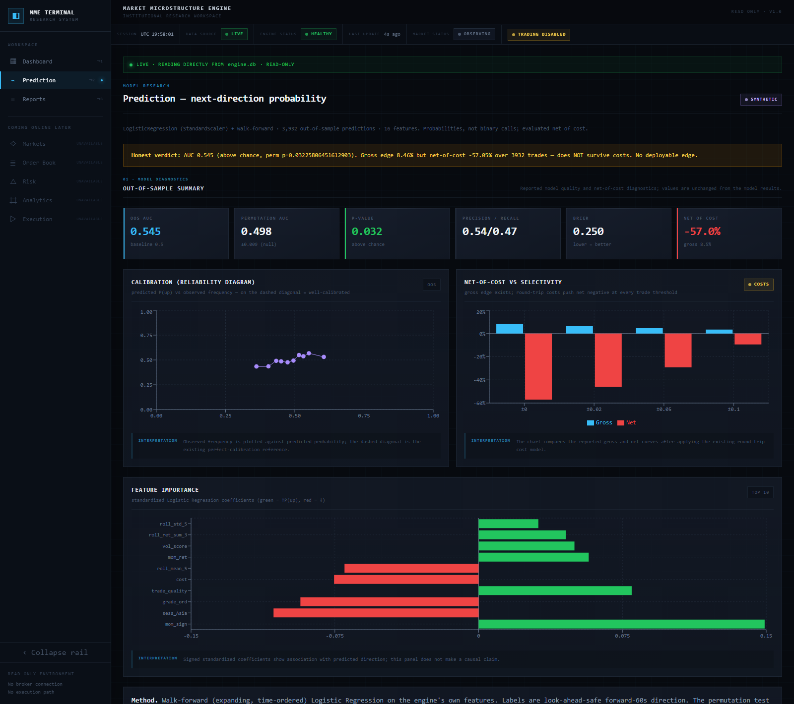
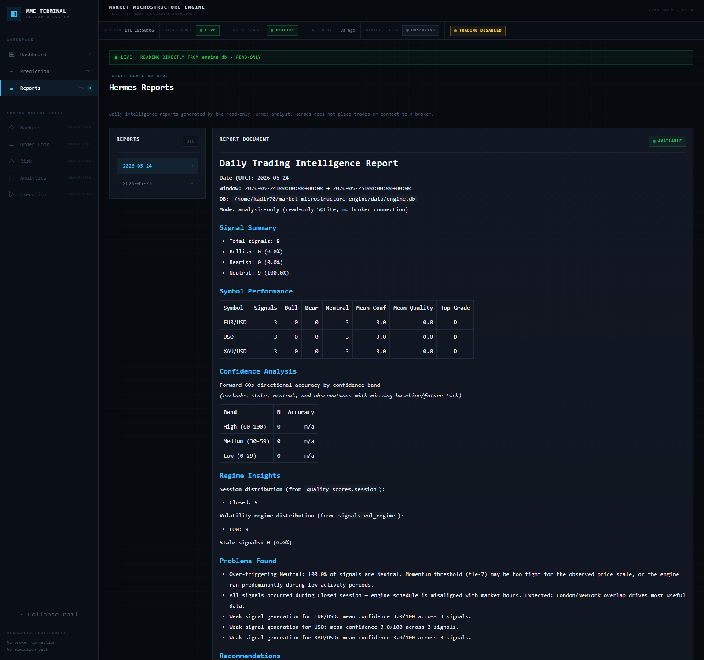
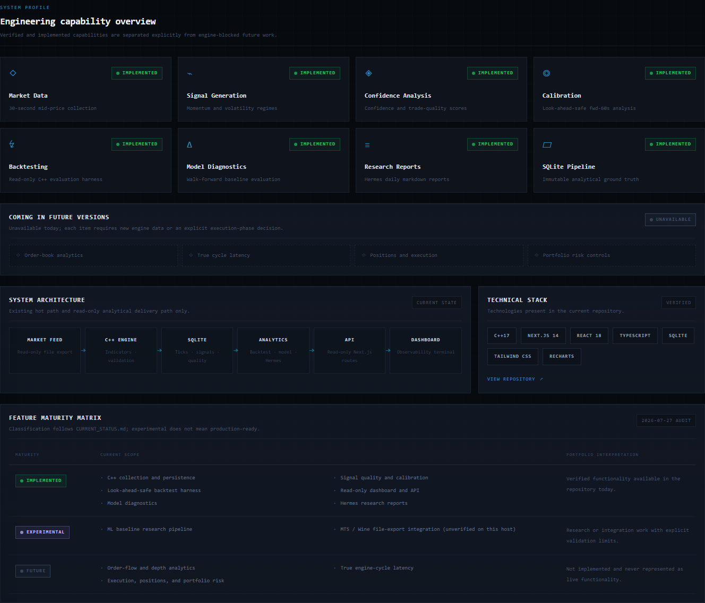
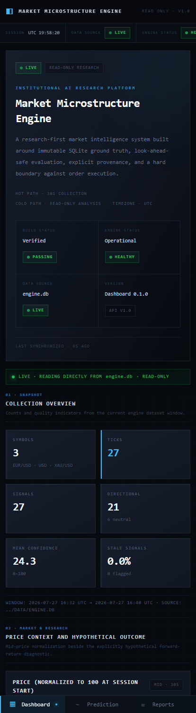

<div align="center">

# Market Microstructure Engine

**A C++17 market-data collection engine with an immutable SQLite ground-truth store,
a look-ahead-safe evaluation harness, and a read-only Next.js research terminal.**

*Research and data-collection infrastructure. It does not place trades — there is no execution path in the codebase.*

[](https://github.com/Kadir70-dev/market-microstructure-engine/actions/workflows/ci.yml)
[](CMakeLists.txt)
[](dashboard/package.json)
[](dashboard/package.json)
[](dashboard/tsconfig.json)
[](#database-schema)
[](dashboard/tailwind.config.ts)
[](dashboard/components/charts.tsx)

[](API_CONTRACT.md)
[](CURRENT_STATUS.md)
[](#running-the-dashboard)
[](#the-no-execution-boundary)

</div>

---

## Project overview

### The problem

Retail algorithmic trading projects usually fail for reasons that have nothing to do with
strategy quality:

1. **Untrustworthy data** — stale quotes, weekend freezes, cached responses, and symbol
   resolution bugs silently poison every downstream number.
2. **Look-ahead bias** — backtests that peek at future prices, or that interpolate across
   engine downtime, produce returns that evaporate on live data.
3. **No survivability** — a collector that dies at 02:00 UTC and is not noticed has no
   Sharpe ratio at all.
4. **No firewall between analysis and execution** — "just let it trade" is how accounts
   get destroyed.

This repository attacks (1)–(4) first and treats alpha as a separate, later problem to be
*measured* rather than assumed.

### What it actually is

A single-host research system in three parts:

- **A C++17 engine** that reads quotes from a CSV exported by an MQL5 Expert Advisor,
  computes momentum, volatility, staleness, session, confidence and trade-quality on a
  30-second cycle, and writes raw ticks plus derived signals to SQLite in one transaction
  per cycle.
- **A read-only analysis layer** — a separate C++ backtest binary that links only sqlite3,
  a Python daily analyst ("Hermes"), and a walk-forward logistic-regression baseline.
- **A read-only Next.js terminal** that re-derives every displayed number from the same
  SQLite ground truth, using the same look-ahead gates and cost model as the C++ harness.

### Research purpose

The engine exists to answer one question honestly: *does a measurable directional edge
survive transaction costs at this data resolution?* On the data collected so far the
answer is **no** — and the system reports that rather than hiding it. Establishing an edge
would require weeks of session-aligned collection and, more importantly, a finer data
resolution than the current feed provides.

### The no-execution boundary

There is no order-execution code path anywhere in this repository. Not disabled — absent.
The MQL5 exporter has no order calls, the engine only reads a file, the analysis layer
opens the database read-only, and the dashboard has no write path. Telegram alerting is
wired for infrastructure events only. This is an architectural property, not a config flag.

---

## Screenshots

### Dashboard — live SQLite mode

Collection KPIs, normalized multi-symbol price, the explicitly hypothetical equity
diagnostic, signal composition, calibration and feed health. The header strip shows session
clock, data provenance, engine status and last-update age.



### Prediction — model diagnostics

Out-of-sample AUC against a permutation null, reliability diagram, net-of-cost curve by
trade threshold, and standardized feature coefficients. The verdict banner states the
honest conclusion, and the badge marks the source as synthetic because the live database is
not yet trainable.



### Hermes reports

The read-only Python analyst's daily markdown, rendered with GitHub-flavored tables:
signal summary, per-symbol performance, confidence-band accuracy, regime distribution, and
an automatically generated *Problems Found* section.



### System profile

Implemented capabilities, unavailable future work, the current architecture path, the stack
actually present in the repository, and a maturity matrix that mirrors
[`CURRENT_STATUS.md`](CURRENT_STATUS.md).



### Mobile

The same terminal at 414 px: two-column KPI grid, bottom navigation, no horizontal page
scroll.



---

## Architecture

```
        ┌─────────────────────────────────────────────┐
        │  MetaTrader 5 (Wine)                        │
        │  └── MQL5 EA: mt5_file_export.mq5           │   read-only, demo-gated
        │        └── mme_quotes.csv                   │   symbol,epoch,bid,ask,mid
        └───────────────────────┬─────────────────────┘
                                │  file read, mtime = freshness
                                ▼
        ┌─────────────────────────────────────────────┐
        │  C++ ENGINE  (single binary, 30s cycle)     │
        │    FileProvider  →  mid price               │
        │    Indicators    →  momentum · volatility   │
        │    Validation    →  staleness · session ·   │
        │                     confidence · quality    │
        └───────────────────────┬─────────────────────┘
                                │  one transaction per cycle
                                ▼
        ┌─────────────────────────────────────────────┐
        │  SQLite  data/engine.db   (ground truth)    │
        │    ticks · signals · quality_scores         │
        └──────┬───────────────┬──────────────┬───────┘
               │ read-only     │ read-only    │ read-only
               ▼               ▼              ▼
     ┌──────────────┐  ┌──────────────┐  ┌──────────────────┐
     │ engine_back- │  │ Hermes       │  │ Research         │
     │ test (C++)   │  │ (Python)     │  │ (scikit-learn)   │
     │ look-ahead   │  │ daily .md    │  │ walk-forward     │
     │ safe gates   │  │ reports      │  │ baseline         │
     └──────────────┘  └──────┬───────┘  └────────┬─────────┘
                              │                   │
                              ▼                   ▼
        ┌─────────────────────────────────────────────┐
        │  REST API  (Next.js route handlers, GET)    │
        │  8 read-only endpoints · no-store · v1.0    │
        └───────────────────────┬─────────────────────┘
                                ▼
        ┌─────────────────────────────────────────────┐
        │  DASHBOARD  (Next.js · React · Recharts)    │
        │  3 routes · 10s polling · provenance badges │
        └─────────────────────────────────────────────┘
```

The hot path (feed → engine → SQLite) and the cold path (SQLite → analysis → API →
dashboard) share nothing but the database file, and the cold path opens it read-only. A bug
in analysis cannot corrupt collected data.

---

## Features

Classification below matches [`CURRENT_STATUS.md`](CURRENT_STATUS.md) exactly.

### Implemented

| Capability | Where |
|---|---|
| 30-second mid-price collection for 3 symbols (EUR/USD, XAU/USD, USO) | `src/main.cpp`, `src/market_data/file_provider.cpp` |
| Momentum and volatility-regime classification | `src/indicators/` |
| Staleness, UTC session, confidence and trade-quality grading | `src/validation/validation.cpp` |
| Atomic per-cycle persistence to three SQLite tables | `src/storage/sqlite_logger.cpp` |
| Look-ahead-safe backtest at +60s / +300s / +900s with a per-symbol cost model | `src/evaluation/` |
| C++ unit tests and Python Hermes tests, both registered with CTest and run in CI | `tests/`, `agent/hermes/tests/` |
| Read-only daily analyst producing markdown reports with auto-detected problems | `agent/hermes/` |
| Walk-forward logistic baseline with permutation test and net-of-cost evaluation | `agent/research/` |
| Eight read-only REST endpoints with a frozen contract and a uniform error envelope | `dashboard/app/api/`, `dashboard/lib/api.ts` |
| Read-only terminal: 3 routes, 9 chart components, per-panel loading/error/empty states, 10s polling with hidden-tab pause | `dashboard/` |
| Explicit data provenance (`source` + `sourceReason`) surfaced on every route | `dashboard/lib/db.ts`, `dashboard/components/ui.tsx` |
| Operations layer: idempotent start/stop/status, 6-point health check, cron and systemd units | `ops/` |

### Experimental

| Item | Limitation |
|---|---|
| ML baseline research pipeline | Trained on a **disclosed synthetic session** because the live database is not yet trainable; the pipeline refuses to train on insufficient data and says so |
| MT5 / Wine file-export integration | Code complete, **unverified on the host used for the release audit** — validated against a CSV in the exporter's exact schema |

### Future — not implemented, never displayed as live

| Item | Blocker |
|---|---|
| Order-flow, spread and depth analytics | `ticks` persists **mid only**; bid/ask are parsed then discarded. Requires a schema migration |
| True engine-cycle latency | No timing instrumentation exists; requires a new table and C++ changes |
| Execution, positions, portfolio risk, real PnL | No execution path exists by design; requires an explicit human phase decision |

Unavailable capabilities appear in the interface as disabled, labelled *Unavailable*. They
are never mocked with placeholder numbers.

---

## The dashboard

Three routes, all read-only, all re-deriving their numbers from `engine.db`.

**Overview (`/`)** — collection KPIs (symbols, ticks, signals, directional count, mean
confidence, stale percentage); normalized multi-symbol price chart; the hypothetical equity
curve; momentum mix, trade-quality grades and confidence histogram; confidence calibration;
feed health; and the system-profile section.

**Prediction (`/prediction`)** — out-of-sample AUC versus a permutation null, p-value,
precision/recall, Brier score, net-of-cost result, reliability diagram, net-of-cost versus
selectivity, and standardized feature importance.

**Reports (`/reports`)** — the Hermes archive with a date selector and full GFM markdown
rendering.

**System health** — the header strip carries session clock, data source, engine status,
last-update age and market-observation status; the feed-health panel shows per-symbol tick
counts, last price, last tick time and frozen-feed detection mirroring
`validation.cpp::isStale`.

**Analytics, confidence and calibration** — signal composition by symbol, A/B/C/D grade
distribution, a ten-bin confidence histogram, and forward-60s realized accuracy by
confidence band. Calibration applies the same exclusions as the C++ backtest: neutral
signals excluded, stale signals excluded, baseline required within 120 s before the signal,
future tick required within 120 s of the horizon. Observations that fail a gate are
**dropped, never imputed** — a band with no usable observations reports `null`, not `0`.

**Research honesty** — the equity curve is labelled hypothetical everywhere it appears,
because these signals were never traded. The model page renders its verdict verbatim,
including the conclusion that the measured edge does not survive costs.

---

## Technical stack

| Layer | Technology |
|---|---|
| Engine | C++17 · spdlog · SQLite3 |
| Evaluation harness | C++17, links **only** sqlite3 — no engine code, no logging framework |
| Analysis | Python 3 standard library (Hermes) · NumPy · pandas · scikit-learn · matplotlib (research) |
| Database | SQLite — three tables, indexed on `(symbol, ts)` |
| API | Next.js 14 App Router route handlers, Node runtime, GET only |
| Frontend | React 18 · TypeScript 5.6 · Tailwind CSS 3.4 |
| Visualization | Recharts 2.12 |
| Markdown | react-markdown 9 · remark-gfm 4 |
| Database driver | better-sqlite3 11 (optional dependency, opened `readonly: true`) |
| Testing | Zero-framework C++ assertions + Python `unittest`, both driven by CTest |
| Build | CMake ≥ 3.16 (out-of-source) · npm |
| CI | GitHub Actions — C++ build and tests, dashboard build, ML pipeline reproduction |

---

## Database schema

Three tables, each indexed on `(symbol, ts)`. Timestamps are unix seconds, UTC.

```sql
ticks(ts, symbol, price)                                              -- raw mid prices, never derived
signals(ts, symbol, momentum, vol_score, vol_regime)                  -- indicator output per cycle
quality_scores(ts, symbol, stale, session, confidence, trade_quality, grade)
```

The split is deliberate: signals and quality scores are **re-derivable** from ticks. Change
a formula, re-run history — no re-collection needed. All three rows for a cycle share one
timestamp and commit in a single transaction, so a JOIN can never silently drop a
half-written cycle.

---

## Repository layout

```
market-microstructure-engine/
├── CMakeLists.txt              Three targets: engine, engine_backtest, unit_tests
├── API_CONTRACT.md             Frozen v1.0 data contracts — authoritative for UI work
├── CURRENT_STATUS.md           Verified state, data inventory, decision log, release audit
├── UI_EXECUTION_PLAN.md        Phased UI plan and engine-side unblockers
├── CLAUDE.md                   Deep engineering reference
│
├── include/                    Public headers, mirroring src/
├── src/
│   ├── main.cpp                Control loop, signal handling, per-symbol processing
│   ├── market_data/            file_provider.cpp — reads the EA's CSV
│   ├── indicators/             momentum.cpp · volatility.cpp
│   ├── validation/             validation.cpp — staleness, session, confidence, quality
│   ├── storage/                sqlite_logger.cpp — best-effort, never crashes the engine
│   └── evaluation/             main.cpp (SQL + printing) · metrics.cpp (pure math)
├── tests/                      unit_tests.cpp — zero external test framework
│
├── dashboard/
│   ├── app/                    3 routes + 8 API route handlers + error/loading boundaries
│   ├── components/             shell · layout · charts · states · portfolio · ui
│   └── lib/                    db · analytics · quant · api · client · useLiveData · types
│
├── agent/
│   ├── hermes/                 Read-only Python analyst + tests
│   ├── mt5_bridge/             mt5_file_export.mq5 — the MQL5 exporter
│   └── research/               Walk-forward baseline; results/ committed
│
├── ops/                        start/stop/status/health/recovery/cron/systemd
├── docs/                       Operations, runbook, recovery, MT5 setup, img/
├── reports/snapshots/          Sample backtest and health snapshots
└── data/                       SQLite ground truth (gitignored)
```

---

## Running

### Requirements

The engine targets Linux. System dependencies (Ubuntu):

```bash
sudo apt install build-essential cmake libspdlog-dev libsqlite3-dev sqlite3 python3
```

Node.js 20+ for the dashboard.

### Build

```bash
cmake -S . -B build
cmake --build build
```

Produces `build/engine`, `build/engine_backtest` and `build/unit_tests`.

### Test

```bash
ctest --test-dir build --output-on-failure                     # C++ and Hermes suites
./build/unit_tests                                             # C++ only
python3 -m unittest agent.hermes.tests.test_daily_report -v    # Hermes only
```

### Run the engine

Both binaries resolve paths relative to the working directory, so run them from `build/`:

```bash
export MME_QUOTES_CSV="$HOME/.mt5/drive_c/Program Files/<Terminal>/MQL5/Files/mme_quotes.csv"
ops/check_quotes.sh "$MME_QUOTES_CSV"      # expect: QUOTES OK: fresh

cd build && ./engine                       # live 30s loop, clean SIGTERM shutdown
cd build && ./engine_backtest              # read-only evaluation
cd build && ./engine_backtest /path/other.db
```

Environment overrides: `MME_QUOTES_CSV`, `MME_FILE_STALE_S` (default 120), `MME_DB_PATH`
(default `../data/engine.db`).

MetaTrader/Wine setup: [`docs/MT5_BRIDGE.md`](docs/MT5_BRIDGE.md).

### Managed operation

```bash
./ops/start_engine.sh          # idempotent background start, verifies it stayed up
./ops/status_engine.sh         # RUNNING/NOT + pid, uptime, last log line
python3 ops/health_check.py    # 6-point read-only health board
./ops/stop_engine.sh           # SIGTERM, then SIGKILL escalation
./ops/run_eod_pipeline.sh      # health + backtest snapshot + Hermes report
```

Optional systemd units for 24/5 operation: [`ops/systemd/`](ops/systemd/).

### Running the dashboard

```bash
cd dashboard
npm install
npm run build
npm start                                          # http://localhost:3000 — DEMO data
DASHBOARD_DB_PATH=../data/engine.db npm start      # live, read-only against engine.db
```

Without `DASHBOARD_DB_PATH` the dashboard renders a deterministic synthetic session derived
with the engine's own formulas, clearly badged as demo. When a path is supplied but cannot
be used, the interface says exactly why (for example *"DASHBOARD_DB_PATH is not set"*)
rather than silently falling back.

Other variables: `DASHBOARD_REPORTS_DIR`, `DASHBOARD_MODEL_PATH`, `DASHBOARD_CACHE_TTL_MS`
(default 5000).

---

## API

Eight `GET` endpoints, Node runtime, `Cache-Control: no-store`, no write methods anywhere.
Success payloads are returned unwrapped; every failure answers with
`{ "error": { "code", "message" } }` and a 4xx/5xx status. Full schemas:
[`API_CONTRACT.md`](API_CONTRACT.md) (frozen at v1.0).

| Endpoint | Returns |
|---|---|
| `GET /api/overview` | Provenance, symbols, row counts, stale percentage, momentum mix, mean confidence, collection window |
| `GET /api/prices` | Per-symbol `{ts, price}` series, downsampled to ≤300 points |
| `GET /api/signals` | Per-symbol momentum mix, grade counts, regime and session distributions, confidence histogram, calibration bands |
| `GET /api/equity` | Hypothetical cumulative fwd-60s return (gross and net) plus summary statistics |
| `GET /api/health` | Per-symbol tick counts, last price, tick age, frozen-feed flags |
| `GET /api/model` | Walk-forward model metrics, calibration points, feature importance, net-of-cost curve, verdict |
| `GET /api/reports` | Available Hermes report dates, newest first |
| `GET /api/reports/{date}` | One report's markdown; `404` with the standard error body when absent |

There is no authentication layer and none is planned while the surface is read-only — bind
to localhost.

---

## Performance

Measured on the release build; no synthetic benchmarks and no latency claims.

| Metric | Measured value |
|---|---|
| Engine cycle | 30 s poll loop, three symbols per cycle |
| Feed staleness threshold | 120 s (file mtime), configurable |
| Dashboard poll interval | 10 s, paused while the tab is hidden (verified: 0 requests over 25 s hidden) |
| Server dataset cache | 5 s TTL **and** `engine.db` mtime invalidation — verified to pick up new rows without a restart |
| First-load JS | `/` 214 kB · `/prediction` 202 kB · `/reports` 135 kB |
| Test suite | 2/2 CTest suites pass — C++ unit tests ~0.01 s, Hermes ~0.6 s |
| Responsive layout | No horizontal page overflow at 375 / 768 / 1440 px |
| Accessibility spot-check | No unnamed interactive controls, no missing image alt text, no heading-level skips |

**Not measured, and therefore not claimed:** wire latency, order-ack latency, throughput
under load, and any HFT-class timing. The system polls a file every 30 seconds; it is not a
low-latency system and does not pretend to be one.

### Current research result

From `agent/research/results/model_results.json`, computed on a disclosed synthetic session
because the live database does not yet contain enough directional variance to train on:

| Metric | Value |
|---|---|
| Out-of-sample AUC | 0.545 versus permutation null 0.498 ± 0.009, p = 0.032 |
| Precision / Recall | 0.54 / 0.47 |
| Brier score | 0.250 |
| Gross return | +8.46 % over 3,932 trades |
| **Net of cost** | **−57.05 %** |

**Verdict: a weak, statistically-real directional signal that transaction costs erase. No
deployable edge.** That is the correct finding for this data resolution, and reporting it is
the point of the system.

---

## Roadmap

All items below are **future work**. Nothing here is implemented.

| Phase | Goal | Money at risk |
|---|---|---|
| Persist bid/ask | Add nullable `bid`/`ask` to `ticks`, unlocking the first genuine spread metrics | None |
| Cycle instrumentation | A `cycle_timings` table for fetch/compute/persist durations | None |
| Edge research | Weeks of session-aligned collection; empirical volatility percentiles replacing hardcoded thresholds; a net-of-cost edge demonstrated or refuted | None |
| Tick-level feed | Move beyond 30-second snapshots — required before any claim about microstructure | None |
| Paper / demo execution | Order operations behind an explicit gate, demo account only | Demo only |
| Sized live | Only if an edge survives demo execution; small fixed size, kill-switch first | Real, minimal |

The order is deliberate: prove survivability and honesty before alpha, prove alpha before
risk.

---

## Known limitations

- **No demonstrated edge.** Current data is small and net return is negative after costs.
- **30-second polling, not tick-level.** The architecture is a microstructure engine; the
  current feed resolution is coarse. This is the single biggest gap between the name and the
  data.
- **Mid prices only.** Bid/ask are read from the feed and discarded at persistence time.
- **Tests cover pure logic, not I/O edges.** Validation, metrics and Hermes report
  generation are unit-tested; the file reader, SQLite writer and MT5 path are not.
- **MT5-under-Wine dependency.** The terminal and Expert Advisor must stay running; a stall
  is detected, not silently ignored.
- **Volatility thresholds are hardcoded**, not empirically calibrated.
- **`USO` is an ETF proxy** for crude, not the underlying CFD.
- **Single host, single process.** No high availability; recovery is restart-based.

---

## Why this project exists

This was built as a systems-and-quant engineering exercise with one governing rule: **never
present a number the data does not support.**

That rule produced most of the design decisions worth discussing here — separating raw ticks
from derived signals so formulas can be re-run over history; making the evaluation harness a
separate binary that links only sqlite3 so it cannot touch engine state; excluding
observations that span downtime instead of interpolating across them; carrying data
provenance all the way into the interface so a demo session can never be mistaken for live
data; and shipping a dashboard that labels its own equity curve hypothetical and its own
model verdict negative.

The uncomfortable result — a statistically real signal that transaction costs destroy — is
the honest output of the pipeline, and it is displayed as prominently as anything else. A
backtest claiming otherwise on this data would be lying.

---

## License

See [LICENSE](LICENSE) if present; otherwise all rights reserved by the author.

---

<div align="center">

**Read-only research system · no broker connection · no order routing · all times UTC**

[API contract](API_CONTRACT.md) · [Current status](CURRENT_STATUS.md) · [Execution plan](UI_EXECUTION_PLAN.md) · [Engineering reference](CLAUDE.md) · [Operations](docs/OPERATIONS.md)

</div>
